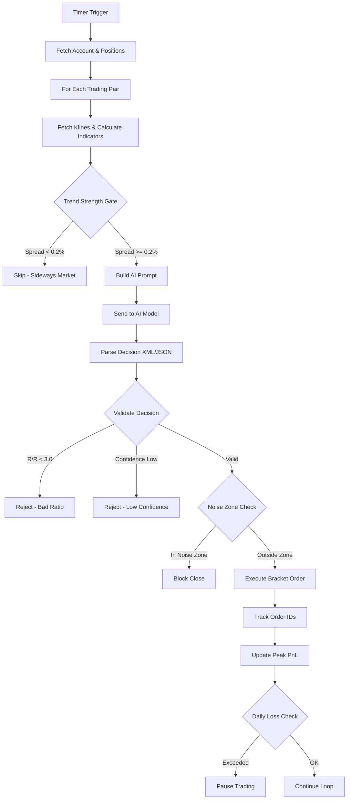

# How Auto-Trader-Ahh Works: A Deep Dive

This document details the end-to-end architecture, mathematical models, and execution logic of the **Auto-Trader-Ahh** system. It explains *exactly* how raw market data is transformed into executed orders on the exchange.

---

## 1. The Core Architecture (The Engine)

The system is built around a central event loop in `server/trader/engine.go` that operates on a customizable heartbeat (default: 5 minutes).

### The Event Loop
1.  **Trigger**: A Golang `time.Ticker` wakes up the `tradingLoop`
2.  **Context Synchronization**: The engine locks the mutex (`e.mu.Lock()`) to fetch the latest state (positions, balances) from Binance
3.  **Sequential Processing**: Iterates through every configured trading pair (e.g., `BTCUSDT`, `ETHUSDT`) sequentially, adding a small delay (2s) between them to respect API rate limits
4.  **State Management**: Tracks bracket order IDs, peak PnL per position, daily cumulative PnL, and position first-seen timestamps

---

## 2. Market Data Analysis (The Inputs)

Before involving the AI, the system performs deterministic mathematical analysis using the `MarketData` provider (`server/market/data.go`).

### Mathematical Indicators

#### A. Exponential Moving Average (EMA)
Used for trend identification.

$$
multiplier = \frac{2}{period + 1}
$$

$$
EMA_{today} = (Price_{today} \times multiplier) + (EMA_{yesterday} \times (1 - multiplier))
$$

*   **EMA9**: Fast moving average (9 periods)
*   **EMA21**: Slow moving average (21 periods)
*   **Trend Logic**: If `EMA9 > EMA21`, the trend is **BULLISH**

#### B. Relative Strength Index (RSI)
Used to detect overbought/oversold conditions.

$$
RSI = 100 - \frac{100}{1 + RS}
$$

Where:

$$
RS = \frac{\text{Average Gain}}{\text{Average Loss}}
$$

(over 14 periods)

*   **Overbought**: RSI > 70
*   **Oversold**: RSI < 30

#### C. Average True Range (ATR)
Used to measure volatility for stop-loss sizing.

$$
TR = \max(High - Low, |High - Close_{prev}|, |Low - Close_{prev}|)
$$

$$
ATR = \frac{1}{n} \sum_{i=1}^{n} TR_i
$$

#### D. MACD (Moving Average Convergence Divergence)
Used for momentum and trend confirmation.

*   **Fast Period**: 12
*   **Slow Period**: 26
*   **Signal Period**: 9
*   **Components**: MACD Line, Signal Line, Histogram

#### E. Bollinger Bands (Optional)
Used for volatility-based entries and exits.

*   **Period**: 20
*   **Standard Deviation**: 2

---

## 3. Trend Strength Gate (Pre-AI Filter)

Before consulting the AI, the system applies a **Trend Strength Gate** to filter out sideways markets.

### Logic
```
EMA_Spread = |EMA9 - EMA21| / CurrentPrice * 100
```

*   **Rule**: If `EMA_Spread < 0.2%`, do NOT open new positions
*   **Why**: In sideways/choppy markets, EMA crossovers produce false signals. A 0.2% spread indicates a definitive trend

---

## 4. The AI Decision Process (The "Brain")

The system constructs a highly specific prompt context (`server/decision/prompt_builder.go`) to force a structured output.

### A. Context Injection (The Prompt)
The AI receives a formatted text block containing:
1.  **Account State**: Equity, Available Balance, Margin Used %, Unrealized PnL
2.  **Market Data**: Calculated EMA, RSI, MACD, ATR values, plus the last 100 candlesticks
3.  **Active Positions**: Detailed metadata including Entry Price, Current PnL %, Hold Duration
4.  **Global Context**: BTCUSDT 24h statistics for market sentiment
5.  **Noise Zone Config**: Current bounds for the noise protection zone

### B. Inference & Streaming
The request is sent to an AI provider (e.g., OpenRouter) utilizing **streaming capabilities**:
*   **Streaming**: Tokens are flushed as they arrive, critical for models with Chain of Thought (CoT) reasoning
*   **Chain of Thought**: The system captures `<reasoning>` blocks where the AI thinks through support levels, market psychology, and indicator divergence

### C. Output Schema (NOFX-Style)
The AI must output in this format:

```xml
<reasoning>
Analysis of market conditions, indicator divergence, support/resistance levels...
</reasoning>

<decision>
```json
[
  {
    "symbol": "BTCUSDT",
    "action": "open_long",
    "leverage": 10,
    "position_size_usd": 500,
    "stop_loss": 98500,
    "take_profit": 102000,
    "confidence": 85,
    "reasoning": "RSI divergent on 1H, EMA9 crossing EMA21..."
  }
]
```
</decision>
```

### D. Supported Actions
| Action | Description |
|--------|-------------|
| `open_long` | Open a long position |
| `open_short` | Open a short position |
| `close_long` | Close existing long position |
| `close_short` | Close existing short position |
| `hold` | Keep current position, no action |
| `wait` | No position, no action |

---

## 5. Validation & Risk Management (The Math)

This is the most critical safety layer. Even if the AI says "BUY", the code (`server/decision/validator.go`) applies strict mathematical constraints.

### A. Risk/Reward Ratio (Hard Constraint)
The system enforces a minimum **3:1** Reward-to-Risk ratio.

$$
\text{Risk} = \frac{|Entry - StopLoss|}{Entry}
$$

$$
\text{Reward} = \frac{|TakeProfit - Entry|}{Entry}
$$

$$
\text{Ratio} = \frac{\text{Reward}}{\text{Risk}}
$$

*   **Rule**: If `Ratio < 3.0`, the trade is **REJECTED** immediately

### B. Position Sizing
Different limits for BTC/ETH vs Altcoins:

| Symbol Type | Max Leverage | Max Position % | Min Position USD |
|-------------|--------------|----------------|------------------|
| BTC/ETH | 10x (configurable to 20x) | 5x equity | $60 |
| Altcoins | 20x | 1x equity | $12 |

*   **Formula**: `PositionSizeUSD = AvailableBalance * (PositionPct / 100) * Leverage`

### C. Confidence Threshold
*   **Default Minimum**: 85%
*   **Rule**: If AI confidence < MinConfidence, trade is **REJECTED**

### D. Anti-Hedging Protection
*   **Rule**: Cannot open opposite position if one already exists for the same symbol
*   **Why**: Prevents API errors and conflicting positions

---

## 6. Noise Zone Protection (Three-Zone Management)

To prevent "death by a thousand cuts" in choppy markets, the system implements three trading zones:

### Zone Definitions

```
       DANGER ZONE           NOISE ZONE           PROFIT ZONE
    (Allow Close)      (Block Most Closes)      (Allow Close)
<-----------|---------------------|----------------------->
         -1.5%                  +1.5%
```

### Rules
1.  **Danger Zone** (`PnL < -1.5%`): Allow closing to cut losses
2.  **Noise Zone** (`-1.5% to +1.5%`): **BLOCK** closing unless:
    - AI Confidence > 95% (override)
    - Min hold duration exceeded (default 10 min)
3.  **Profit Zone** (`PnL > +1.5%`): Allow closing to take profits

### Why This Exists
At 20x leverage:
*   -1.5% price move = -30% equity loss
*   Within the noise zone, normal market fluctuations cause panic selling
*   Blocking closes in this zone prevents emotional trading

---

## 7. Advanced Position Management

### A. Peak PnL Tracking
The system tracks the highest profit % reached for each position:
*   **Purpose**: Detect when profits are slipping away
*   **Stored**: In-memory cache `peakPnLCache[symbol]`

### B. Drawdown Protection
*   **Trigger**: Position has reached +5% profit at some point
*   **Rule**: If current PnL drops 40% from peak, force close
*   **Example**: Peak was +10%, now at +6%, drawdown = 40% → force close
*   **Why**: Protects gains in volatile markets

### C. Trailing Stop Loss
*   **Activation**: When position reaches +1% profit
*   **Trail Distance**: 0.5% behind peak price
*   **Behavior**: Stop loss moves up as price increases, never moves down
*   **Implementation**: Updates the stop-loss order on exchange

### D. Smart Loss Cut
*   **Trigger**: Position has been losing for 30+ minutes
*   **Condition**: Current loss > 1%
*   **Action**: Force close to prevent further bleeding
*   **Why**: Time-based exit for positions that aren't recovering

### E. Max Hold Duration
*   **Default**: 240 minutes (4 hours)
*   **Rule**: Force close any position held longer than max duration
*   **Why**: Prevents capital lock-up in stagnant positions

---

## 8. Daily Risk Controls

### A. Daily Loss Limit
*   **Default**: 15% of starting daily equity
*   **Trigger**: When cumulative daily PnL drops below -15%
*   **Action**: Stop trading for configured minutes (default 30)
*   **Optional**: Close all positions on trigger

### B. Emergency Shutdown
*   **Threshold**: $60 minimum balance (configurable)
*   **Trigger**: When total wallet balance drops below threshold
*   **Action**: Halt all trading completely
*   **Why**: Prevents account from being fully liquidated

---

## 9. Execution Logic (The "Hands")

When a decision is validated, the `Trader` engine executes it via the Binance API.

### Bracket Orders Execution
The system implements "Bracket Orders" (atomic Entry + SL + TP) by managing three separate orders:

1.  **Entry Order**: A `MARKET` order placed immediately
2.  **Stop Loss (SL)**: A `STOP_MARKET` order at the calculated stop price
    *   *Trigger*: `Last Price <= SL Price` (Long) or `Last Price >= SL Price` (Short)
3.  **Take Profit (TP)**: A `TAKE_PROFIT_MARKET` order at the target price
    *   *Trigger*: `Last Price >= TP Price` (Long) or `Last Price <= TP Price` (Short)

### Lifecycle Management
*   **Tracking**: Order IDs (`StopLossOrderID`, `TakeProfitOrderID`) stored in memory
*   **Cleanup**: When position closes (manually or via TP), system cancels the hanging SL order (and vice versa)
*   **Auto-Reversal**: Can atomically close SHORT and open LONG in one cycle

---

## 10. Dynamic Coin Selection

### Static Mode
*   Fixed list of trading pairs: `["BTCUSDT", "ETHUSDT", "SOLUSDT"]`
*   Predictable, stable behavior

### Dynamic Mode (Smart Find)
*   **Top Volume**: Automatically selects top 20 coins by 24h volume
*   **Volatility**: Selects coins with highest price swings
*   **Auto-Refresh**: Periodically discovers new opportunities (configurable interval)

### Turbo Mode
*   High-frequency scalping mode
*   Shorter intervals (1-3 minutes)
*   Dynamic coin discovery enabled
*   **Warning**: Higher risk, requires close monitoring

---

## 11. Summary Flowchart



---

## 12. Configuration Reference

### Risk Control Settings
| Setting | Default | Description |
|---------|---------|-------------|
| `max_positions` | 2 | Maximum concurrent positions |
| `btc_eth_max_leverage` | 10 | Max leverage for BTC/ETH |
| `altcoin_max_leverage` | 20 | Max leverage for altcoins |
| `min_confidence` | 85 | Minimum AI confidence to trade |
| `min_risk_reward_ratio` | 3.0 | Minimum R/R ratio |
| `noise_zone_lower` | -1.5 | Lower bound of noise zone (%) |
| `noise_zone_upper` | 1.5 | Upper bound of noise zone (%) |
| `max_daily_loss_pct` | 15 | Daily loss limit (%) |
| `max_drawdown_pct` | 40 | Max drawdown from peak (%) |
| `max_hold_duration_mins` | 240 | Max position hold time |
| `emergency_min_balance` | 60 | Emergency shutdown threshold ($) |

### Indicator Settings
| Setting | Default | Description |
|---------|---------|-------------|
| `timeframe` | 5m | Candlestick timeframe |
| `kline_count` | 100 | Number of candles to fetch |
| `enable_ema` | true | Enable EMA calculation |
| `enable_rsi` | true | Enable RSI calculation |
| `enable_macd` | true | Enable MACD calculation |
| `enable_atr` | true | Enable ATR calculation |
| `enable_bollinger` | false | Enable Bollinger Bands |
| `enable_volume` | true | Enable volume analysis |
